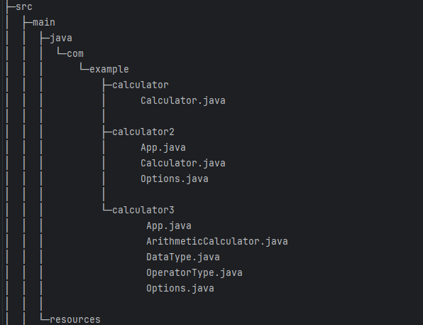

# ⭐️[컬렉션, enum, 제네릭, 람다, 스트림등을 이용한 계산기 프로젝트]⭐️

### 프로젝트 구조



## 💛 LV1(Calculator 패키지)
클래스 활용 없이 기본 연산 수행하는 계산기입니다. </br>
Scanner를 통해 양의 정수(0포함) 두 개, 사칙연산자를 입력받아 연산 진행 후 결과값을 출력합니다.
switch문을 사용하여 사칙연산자를 구분하였고 exit 문자열 입력 전까지 무한으로 계산 진행하도록 구현했습니다.


## 💛 LV2(Calculator2 패키지)
LV1과 기능은 동일하지만 클래스를 나누어 활용한 계산기입니다. </br>
**App클래스**에서는 사용자의 입력을 받아 결과물을 보여주는 클래스, Calculator는 사칙연산 및 데이터 저장 클래스, Options 클래스는 App 클래스의 main 메소드 간결화를 위해 만든 클래스입니다.</br>
**Calculator 클래스**에서는 결과값을 반환 및 저장하기 위한 List 컬렉션 타입 필드를 지정하였고 캡슐화를 통해 컬렉션 필드에 직접 접근이 불가하도록 수정했습니다.</br>
캡슐화를 위해 구현한 setter 메소드를 통해 리스트를 초기화하도록 구현하고 가장 먼저 저장된 데이터를 삭제하는 기능 또한 구현되었습니다.
연산 기능 이후 리스트 초기화, 데이터 삭제, exit 입력시 반복 종료되는 코드는 main 메소드의 간결화를 위해 Options 클래스로 옮겨 작성되었습니다.</br>

## 💛 LV3(Calculator3 패키지)
LV1, 2와 기능은 동일하지만 enum, 제네릭, 람다, 스트림을 활용하여 구현된 계산기입니다. </br>
**OperatorType 클래스**는 enum과 람다, 함수형 인터페이스인 BiFunction을 통해 연산이 이루어지도록 하는 메소드를 구현하였습니다.</br>
**ArithmeticCalculator 클래스**는 기존에는 양의 정수만 입력 받았는데 모든 타입의 숫자를 입력 받을 수 있도록 Number와 Number를 상속받은 제네릭 타입 T를 사용했습니다.</br>
또한 람다와 스트림을 사용해서 Scanner로 입력받은 값보다 큰 결과값들을 출력할 수 있는 메소드, 리스트의 데이터들 중 입력받은 숫자의 값을 두배로 높여주는 메소드를 작성했습니다.</br>
**DataType 클래스**는 App클래스에서 Scanner로 값을 입력받을 때 long이 들어올지 double로 들어올지 미리 지정해둘 수 없어서 String으로 받아서 형변환을 하는 parseNumber메소드가 작성되어있습니다.</br>
**Options 클래스**는 LV2에서 작성한 Options 클래스의 내용에 이어서 특정 값보다 큰 데이터 목록 보기, 데이터 목록의 특정 값 두 배로 키우기 옵션이 추가되어 App 클래스에서 실행되도록 구현되어 있습니다.</br>


❗️ 또한 모든 패키지에서는 다음과 같은 경우가 발생할 때를 대비하여 다시 값을 입력받을 수 있도록 처리했습니다.</br>
* 양의 정수가 입력되지 않을 경우
* 숫자가 아닌 다른 값이 입력될 경우
* 사칙연산 기호가 아닌 다른 기호가 입력될 경우
* 나눗셈 연산에서 분모가 0이 입력될 경우
</br>
</br>

### 실행예시
<details>
<summary>LV1 실행 화면 보기</summary>

```
첫 번째 숫자(양의 정수)를 입력하세요: 10
두 번째 숫자(양의 정수)를 입력하세요: 2
사칙연산 기호를 입력하세요(ex:+,-,x,%): +
결과: 12.0
계산을 종료하려면 'exit'을 입력하세요. 계속하려면 아무 키나 입력하세요: ㄷ
첫 번째 숫자(양의 정수)를 입력하세요: 10
두 번째 숫자(양의 정수)를 입력하세요: 0
사칙연산 기호를 입력하세요(ex:+,-,x,%): %
분모(두번째 정수)에 0이 입력된 경우 나눗셈 연산이 불가합니다. 다시 입력해주세요.
첫 번째 숫자(양의 정수)를 입력하세요: 10
두 번째 숫자(양의 정수)를 입력하세요: 10
사칙연산 기호를 입력하세요(ex:+,-,x,%): -
결과: 0.0
계산을 종료하려면 'exit'을 입력하세요. 계속하려면 아무 키나 입력하세요: exit
계산기를 종료합니다.
```
</details>

<details>
<summary>LV2 실행 화면 보기</summary>

```
첫 번째 숫자(양의 정수)를 입력하세요: 10
두 번째 숫자(양의 정수)를 입력하세요: 2
사칙연산 기호를 입력하세요(ex:+,-,x,%): +
결과: 12.0
저장된 데이터: [12.0]
옵션을 선택하세요. 연산을 계속하려면 옵션 외 다른 키를 입력하세요
1: 가장 먼저 저장된 데이터 삭제
2: 리스트 초기화
exit: 프로그램 종료
입력: 1
가장 먼저 저장된 데이터를 삭제했습니다.
현재 데이터 목록: []
첫 번째 숫자(양의 정수)를 입력하세요: 30
두 번째 숫자(양의 정수)를 입력하세요: 4
사칙연산 기호를 입력하세요(ex:+,-,x,%): %
결과: 7.5
저장된 데이터: [7.5]
옵션을 선택하세요. 연산을 계속하려면 옵션 외 다른 키를 입력하세요
1: 가장 먼저 저장된 데이터 삭제
2: 리스트 초기화
exit: 프로그램 종료
입력: 2
리스트를 초기화했습니다.
현재 데이터 목록: []
첫 번째 숫자(양의 정수)를 입력하세요: -1
양의 정수를 입력하셔야 합니다.
첫 번째 숫자(양의 정수)를 입력하세요: 1
두 번째 숫자(양의 정수)를 입력하세요: 4
사칙연산 기호를 입력하세요(ex:+,-,x,%): x
결과: 4.0
저장된 데이터: [4.0]
옵션을 선택하세요. 연산을 계속하려면 옵션 외 다른 키를 입력하세요
1: 가장 먼저 저장된 데이터 삭제
2: 리스트 초기화
exit: 프로그램 종료
입력: exit
프로그램을 종료합니다.
```
</details>

<details>
<summary>LV3 실행 화면 보기</summary>

```
첫 번째 숫자를 입력하세요: 10
두 번째 숫자를 입력하세요: 2
사칙연산 기호를 입력하세요(ex:+,-,x,%): +
결과: 12.0
저장된 데이터: [12.0]
옵션을 선택하세요. 연산을 계속하려면 옵션 외 다른 키를 입력하세요
1: 가장 먼저 저장된 데이터 삭제
2: 리스트 초기화
3: 특정 값보다 큰 데이터 목록 보기
4: 데이터 목록의 특정 값 두 배로 키우기
exit: 프로그램 종료
입력: e
연산을 시작합니다
첫 번째 숫자를 입력하세요: 10
두 번째 숫자를 입력하세요: 4.6
사칙연산 기호를 입력하세요(ex:+,-,x,%): %
결과: 2.173913043478261
저장된 데이터: [12.0, 2.173913043478261]
옵션을 선택하세요. 연산을 계속하려면 옵션 외 다른 키를 입력하세요
1: 가장 먼저 저장된 데이터 삭제
2: 리스트 초기화
3: 특정 값보다 큰 데이터 목록 보기
4: 데이터 목록의 특정 값 두 배로 키우기
exit: 프로그램 종료
입력: 3
특정 값을 입력하세요: 3
결과 목록에서 3.0보다 큰 값: [12.0]
첫 번째 숫자를 입력하세요: 2
두 번째 숫자를 입력하세요: 2
사칙연산 기호를 입력하세요(ex:+,-,x,%): +
결과: 4.0
저장된 데이터: [12.0, 2.173913043478261, 4.0]
옵션을 선택하세요. 연산을 계속하려면 옵션 외 다른 키를 입력하세요
1: 가장 먼저 저장된 데이터 삭제
2: 리스트 초기화
3: 특정 값보다 큰 데이터 목록 보기
4: 데이터 목록의 특정 값 두 배로 키우기
exit: 프로그램 종료
입력: exit
프로그램을 종료합니다.
```
</details>


### 클래스 다이어그램(LV 3 기준)
  